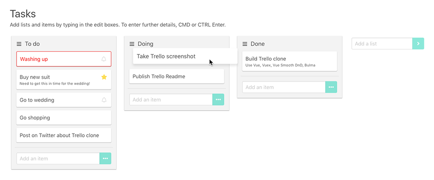

# Vue Trello Clone

A simple Trello clone in Vue, Vuex and Bulma




## Features

Trello features

- Single board
- Re-orderable lists and tasks

Task functionality

- Title, description, date
- Quick entry and full entry modal
- Icons and colors to indicate due and overdue items
- Editable tasks

UI features

- Fast keyboard interaction
- Smooth animation

State management

- Vuex state management
- Persistence


## Setup

``` bash
# install dependencies
npm install

# serve with hot reload at localhost:8080
npm run dev

# build for production with minification
npm run build
```
